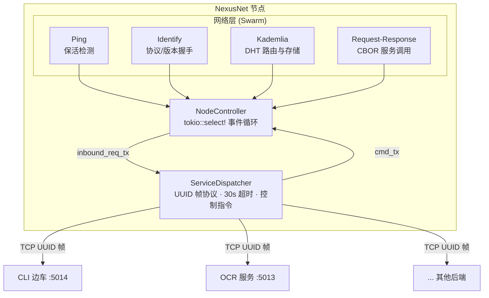

# NexusNet

**OAHD 计划的核心网络层** — 基于 libp2p 的去中心化 P2P 节点网络。

NexusNet 将一台机器接入 P2P 覆盖网络，通过 Kademlia DHT 实现节点自动发现与服务注册查询；利用边车（sidecar）模式，将远程服务请求经 TCP 转发到本地业务进程，业务端语言无关。

## 架构总览



### 微内核 + 边车

- **NodeController** — 单一异步事件循环，集成所有 libp2p 事件处理（Ping/Identify/Kademlia/Request-Response）和后端命令路由。
- **ServiceDispatcher** — 独立后台任务。节点启动时主动连接所有配置的本地后端（重试 3 次），维持持久 TCP 连接。P2P 入站请求经 `inbound_req_tx` 转发到此处，由 `handle_request_with_backend()` 通过 UUID 帧协议发送给后端进程，等待响应后返回。
- **后端透明** — 后端只需要理解 UUID 帧协议即可接入，语言/框架无关。后端也可主动发起控制指令。
- **CBOR 协议** — P2P 层使用 libp2p CBOR 协议，`Request { service, payload }` / `Response { success, data }`。

## 快速开始

### 编译与运行（开发）

```bash
cargo run
```

未设置任何环境变量时，运行回退当前目录，首次运行自动生成 `./config.toml` 和 `./keypair.bin`。

### 命令行参数

```bash
# 指定监听端口
cargo run -- -p 5001

# 添加 bootstrap 节点
cargo run -- -c /ip4/192.168.1.100/tcp/5000/p2p/12D3KooW...

# 覆盖 bootstrap 列表（清空已有，仅连此节点）
cargo run -- --connect-overwrite /ip4/192.168.1.100/tcp/5000/p2p/12D3KooW...
```

所有 CLI 变更自动写回 `config.toml`。

## 部署（systemd / deb）

生产环境以原生的 Debian 包（`.deb`）分发，由 `dpkg`/`apt` 管理生命周期：

```bash
apt install -y ./nexusnet_<version>_amd64.deb
```

安装后服务自动启用（`postinst` 创建专用用户 `nexusnet`、目录并 `enable`），
配置与数据落位到标准目录：

| 文件 | 路径 | 说明 |
|---|---|---|
| 配置 | `/etc/nexusnet/config.toml` | 首启自动生成 |
| 节点身份 | `/var/lib/nexusnet/keypair.bin` | 不可丢失，升级/卸载保留 |
| 日志 | journald | systemd 采集/轮转/压缩/保留 |

查看运行状态：`systemctl status nexusnet`；日志：`journalctl -u nexusnet -f`。

构建、升级、卸载等详见 [deploy/README.md](./deploy/README.md)。

## 配置（config.toml）

```toml
[node]
name = "未设置的p2p节点"
description = "无详细描述"
allow_bootstrap = true

[network]
ipv4_enabled = false
ipv4_address = "x.x.x.x"       # 可选，不设则自动检测
ipv6_enabled = false
ipv6_address = "x:x::x"        # 可选
port = 5000
announce_addresses = []         # 手动指定宣告地址

[services.ping]
enabled = true
interval_secs = 15
with_timeout = 10
max_failures = 2

[services.kademlia]
enabled = true
record_ttl_seconds = 3600
replication_factor = 20
query_timeout_seconds = 60
bootstrap_nodes = []

[services.dispatcher]
enabled = true
query_timeout_secs = 60
record_ttl_secs = 3600

[[services.dispatcher.local_services]]
name = "cmd"
host = "127.0.0.1"
port = 5014
require_auth = false

[services.relay]
retry_interval_secs = 60
max_failures = 3

[crypto]
pq_transport_enabled = false
pq_identity_enabled = false
pq_required = false

[auth]
network = "none"                 # "none" = 不鉴权
cache_ttl_secs = 300
refresh_interval_secs = 60

[auth.networks.myorg]            # 每个鉴权网络的信任锚
authority = "<base64 ed25519 公钥>"
```

所有字段均有 `#[serde(default)]`，省略即默认值。

配置路径由环境变量决定（见 `src/paths.rs`）：`NEXUSNET_CONFIG`、`NEXUSNET_KEYPAIR`、
`NEXUSNET_LOG_PATH`（仅文件输出模式用；systemd 下日志走 journald）、`NEXUSNET_HOME`；
未设置时回退当前目录。

## 启动流程

```
boot::init()
  ├─ 读取 config.toml（损坏/不存在 → 创建默认）
  ├─ CLI 参数覆盖 & 写回
  ├─ 更新公网 IP 到配置
  ├─ 加载/生成 keypair.bin（ED25519 节点身份）
  ├─ 尝试加载 keypair.pq.bin（PQ 密钥，可选，不存在则跳过）
  ├─ Network::start() → 构建 Swarm 并启动 SwarmActor
  ├─ 拨号所有 bootstrap 节点
  ├─ 启动 ServiceDispatcher（后台 tokio::spawn）
  ├─ 启动 auth_refresher（后台鉴权缓存刷新）
   └─ NodeController::run()（主协程）
        tokio::select! {
            event_rx → 网络事件
            cmd_rx  → 后端命令
            shutdown→ SIGTERM/Ctrl-C 优雅退出
        }
```

## 模块清单

| 模块 | 职责 |
|------|------|
| **boot** | 初始化 |
| **main** | 程序入口 |
| **paths** | 统一路径解析（环境变量锚定，本地回退当前目录） |
| **node_controller** | 事件循环统一处理、服务自动宣告，处理远程查询和内部命令 |
| **service_dispatcher** | 后端连接管理 |
| **network** | 网络层门面：身份、地址探测、行为装配、Swarm Actor（`network/identity`、`network/addr`、`network/behaviour`、`network/builder`、`network/actor`） |
| **config** | 提供ConfigHandle |
| **service_protocol** | 提供通讯协议 |
| **auth** | 鉴权记录层：COSE_Sign1 验签、TUF-lite 一致性防护、内存缓存与判定 |
| **log** | 自动检测输出模式：systemd 下交 journald，其余终端+文件轮转 |

## 后端协议（TCP，v2）

NexusNet 与后端进程之间使用**持久 TCP 连接**，由节点主动发起连接。协议为 **CBOR + CDDL** 契约，规范见 [docs/sidecar.cddl](./docs/sidecar.cddl)。

### 帧

```text
u32_be(len) || cbor(message)      # len <= 16 MiB
```

连接建立后双方首帧必须是 `hello { version }`，版本不兼容则断开。

### 消息

判别字段为文本 `t`：

| `t` | 方向 | 说明 |
|---|---|---|
| `hello` | 双向 | 握手与版本协商 |
| `request` | 节点→后端 | 转发入站服务请求 `{ id, service, payload }` |
| `reply` | 双向 | 关联回复 `{ id, ok, result?, error? }` |
| `list_services` / `discover_providers` / `query_public_ip` / `reconnect_bootstrap` / `reannounce_services` / `reload_config` / `relay_status` / `pq_status` / `auth_status` / `query_key` / `add_key` / `service_request` / `service_request_to` | 后端→节点 | 控制指令，节点以 `reply` 应答 |

- 关联 id 为 UUID；`reply.result` 是该 op 自定的 **CBOR** 字节。
- `add_key` 的 `value` 为 `bstr`，二进制安全（无需 base64）。
- 默认超时 30 秒，超时以 `error{code:"timeout"}` 应答。

## P2P 服务调用流程

```text
后端进程 → 控制消息(service_request, CBOR)
  → ServiceDispatcher.backend_read_loop
  → ControlRequest(cmd_tx) → NodeController.handle_command()
  → discover_providers(service) → DHT get_providers
  → RTT 排序选最优点
  → send_request_to_peer(peer, service, payload)
  → CBOR Request-Response (libp2p)
  → 远程 NodeController → InboundServiceRequest(inbound_req_tx)
  → 远程 ServiceDispatcher.handle_request_with_backend()
  → request 帧 → 远程后端进程
  → reply 沿原路返回
```

## 服务注册与发现

- 本地服务列表由 `config.services.dispatcher.local_services` 定义
- Bootstrap 成功（首次 DHT 查询完成）后自动调用 `start_providing`，key 为 `/oahd/service/<name>`
- 同步 `/oahd/service/types` 全局服务类型记录（put_record/get_record）
- `list_services` → 查询全局服务类型
- `discover_providers` → DHT get_providers 获取提供者列表
- `service_request` → 查询提供者，RTT 排序选优，P2P 调用

## 抗量子加密

应用层混合 PQ 加密，用于服务请求/响应的机密性。关闭时协议不注册、行为与旧版本完全一致。

- **算法**：ML-KEM-768+ X25519 混合 KEM、ChaCha20-Poly1305 AEAD、可选 ML-DSA-65（FIPS 204）签名。
- **协议**：`/oahd/service_req/2.0.0`与 `/oahd/pq_identity/1.0.0`，仅在启用时注册。
- **流程**：请求方 encaps 到响应方 KEM 公钥，响应方 decaps 后双方共享同一密钥，响应复用该密钥加密——无需第二次 KEM，也不在请求里携带请求方公钥。
- **回退**：对端不支持 PQ 时回退明文 `/oahd/service_req/1.0.0`；`crypto.pq_required = true` 则拒绝非 PQ 对端。
- **密钥**：`keypair.pq.bin`。
- `@pq_status` → 查看启用状态。

| 配置 | 含义 |
|---|---|
| `crypto.pq_transport_enabled` | 启用加密服务调用 |
| `crypto.pq_identity_enabled` | 附带并校验 ML-DSA 签名 |
| `crypto.pq_required` | 强制 PQ，拒绝非 PQ 对端 |

## 鉴权

可选的服务级访问控制。节点加入一个**鉴权网络**，权威方（边车）把签名白名单发布到 DHT；
节点收到服务请求时按「DHT 为准 + fail-closed」判定，通过才转发给本地后端。

- **信任模型**：记录由权威 ed25519 私钥签名，DHT 仅作传输；接收方验签后才信任（防伪造、防回滚与重放）。
- **记录**：`/oahd/auth/<net_hash>/service`（索引）与 `/oahd/auth/<net_hash>/<service>`（白名单），
  值为 COSE_Sign1；`net_hash = base64url_nopad(SHA-256(network))`。
- **服务开关**：`services.dispatcher.local_services[].require_auth`。
- **判定**：鉴权关闭或服务未要求鉴权 → 放行；索引/白名单缺失、过期、验签失败 → 拒绝；
  服务不在索引 → 放行并自动把本地 `require_auth` 置为 `false`（网络同步）。
- **边车发布**：签名记录经本地后端控制消息 `add_key { key, value }` 发布（`value` 为 `bstr`，二进制安全）；
  在 `expires_at` 前重发续期。
- **状态查询**：`auth_status`。

完整记录格式、发布流程与验证算法见 [docs/auth.md](./docs/auth.md)。

| 配置 | 含义 |
|---|---|
| `auth.network` | 鉴权网络名；`"none"` 表示不鉴权 |
| `auth.networks.<name>.authority` | 该网络权威 ed25519 公钥（base64） |
| `auth.cache_ttl_secs` | 白名单/索引本地缓存有效期（默认 300s） |
| `auth.refresh_interval_secs` | 后台刷新间隔（默认 60s） |
| `require_auth` | 单个本地服务是否要求鉴权 |

## 日志

输出模式**自动检测**：

- **systemd**：只写 stdout/stderr，**不写文件**；轮转、压缩、保留、检索全部交给 journald。输出为**单行**并带 syslog 级别前缀，可用 `journalctl -u nexusnet -p err` 过滤。
- **其他**：终端 + 文本文件双输出，文件 10MB 触发 gz 轮转。
- 等级：`Critical | Error | Warning | Important | Preset | Debug`；非 TTY 自动去彩色。

## 节点身份

- **ED25519 主身份** — `keypair.bin`，Protobuf 编码，派生 `PeerId`
- **PQ 辅助密钥**— `keypair.pq.bin`
- **keypair.bin 不可丢失** — 丢失后节点身份变更

## 开发状态

当前版本：**0.4.1** — 完成度 **5.5/10**

## 许可

GNU General Public License v3.0

本程序是自由软件：你可以再分发之和/或依照由自由软件基金会发布的 GNU 通用公共许可证修改之，无论是版本 3 许可证，还是（按你的决定）任何以后版。

本程序分发时希望它有用，但**不提供任何保证**；甚至不保证适销性或特定用途的适用性。详情请参见 GNU General Public License。

完整的许可证文本见 [LICENSE](./LICENSE) 文件。
